# ⚓ Port Management ERP

A Java-based web application for managing and monitoring port operations through a centralized Enterprise Resource Planning (ERP) system.

The system provides dedicated modules for ships, cargo, containers, docks, dock allocations, cargo movements, users, profiles, dashboards, and security logs.

---

## 📸 Application Screenshots

<table>
  <tr>
    <td>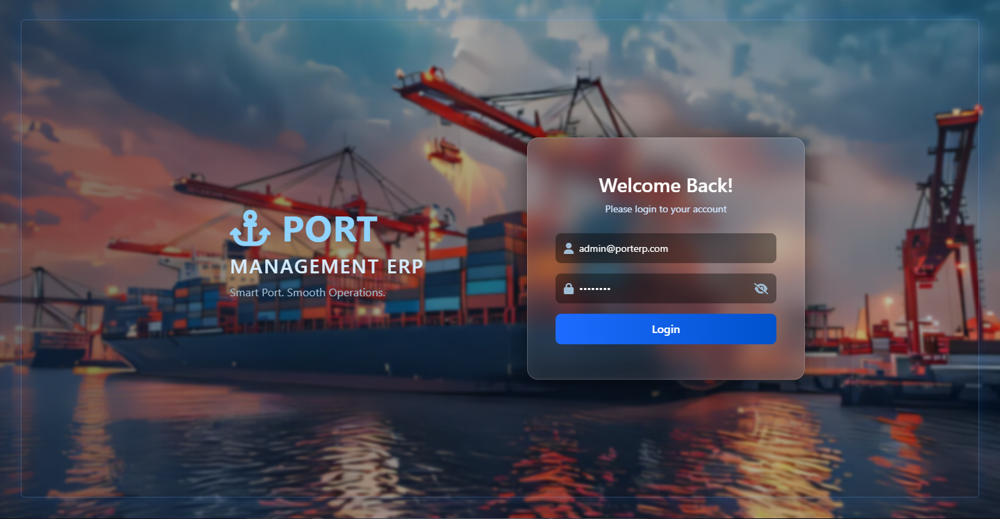</td>
    <td>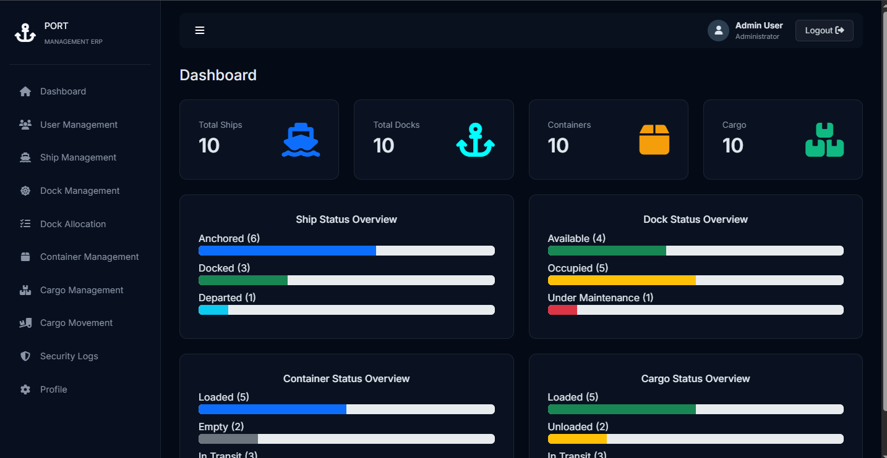</td>
  </tr>
  <tr>
    <td>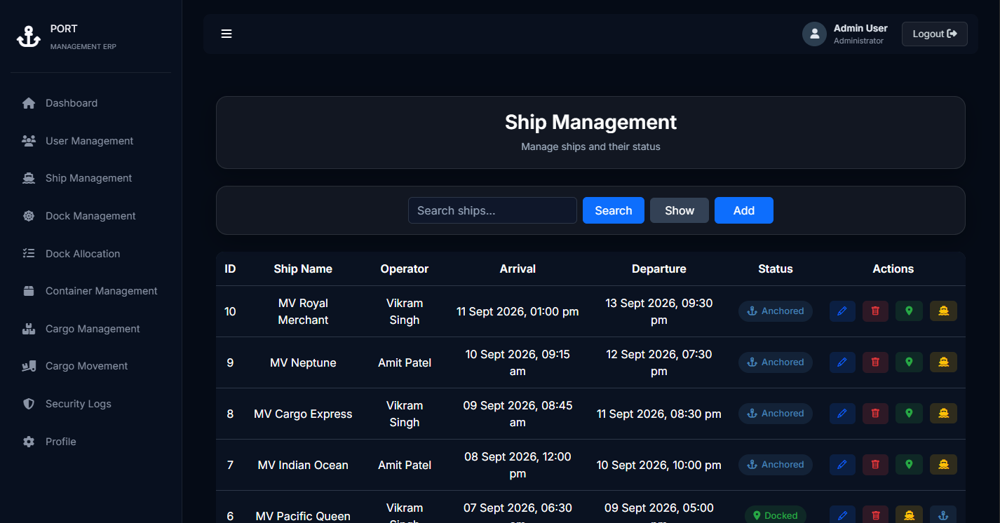</td>
    <td>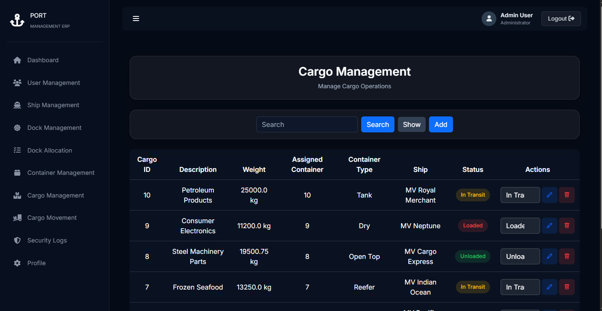</td>
  </tr>
  <tr>
    <td>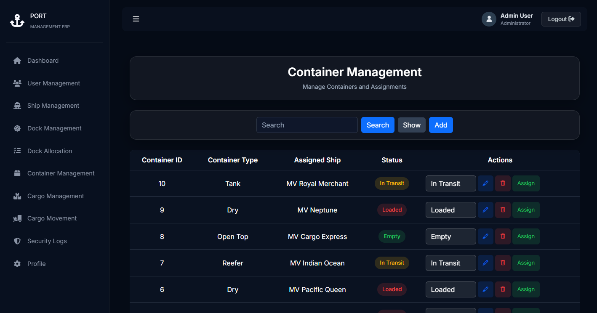</td>
    <td>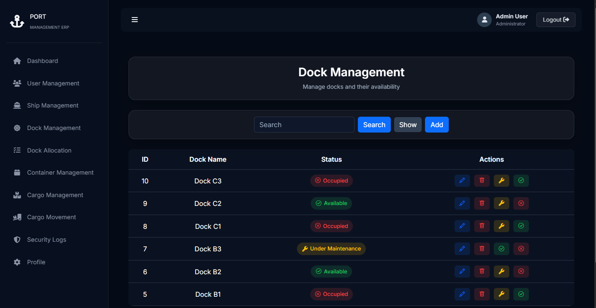</td>
  </tr>
  <tr>
    <td>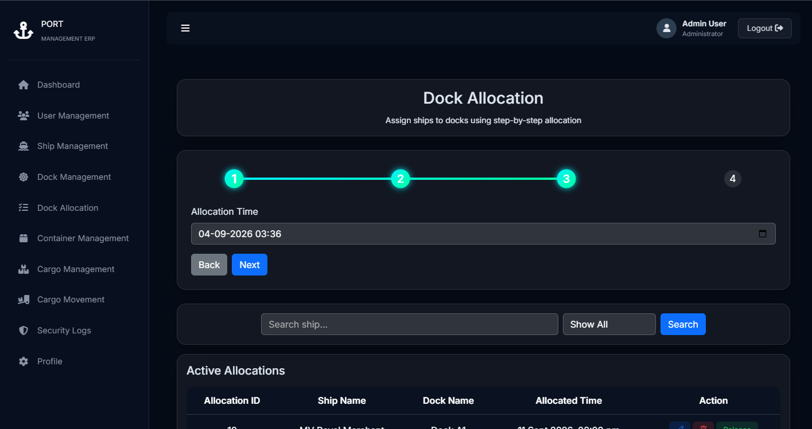</td>
    <td>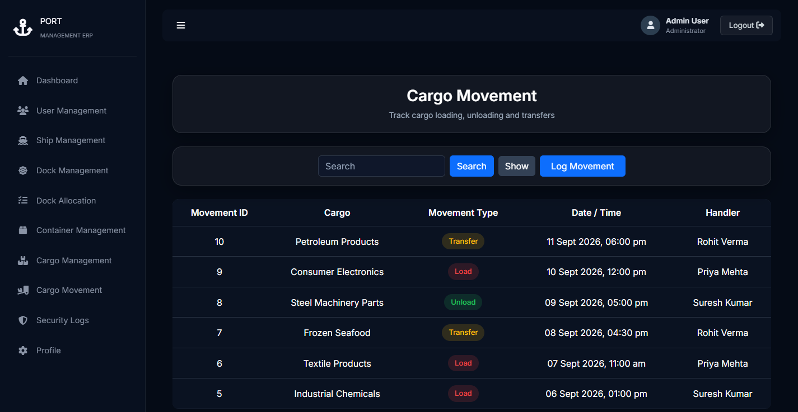</td>
  </tr>
  <tr>
    <td>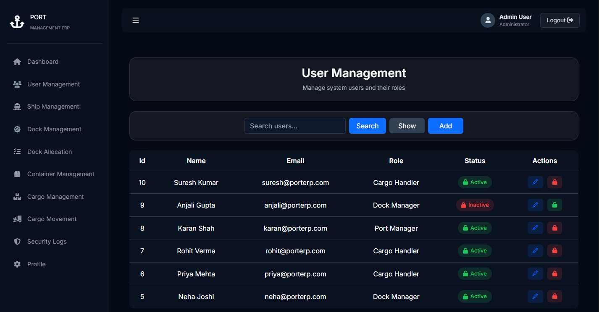</td>
    <td>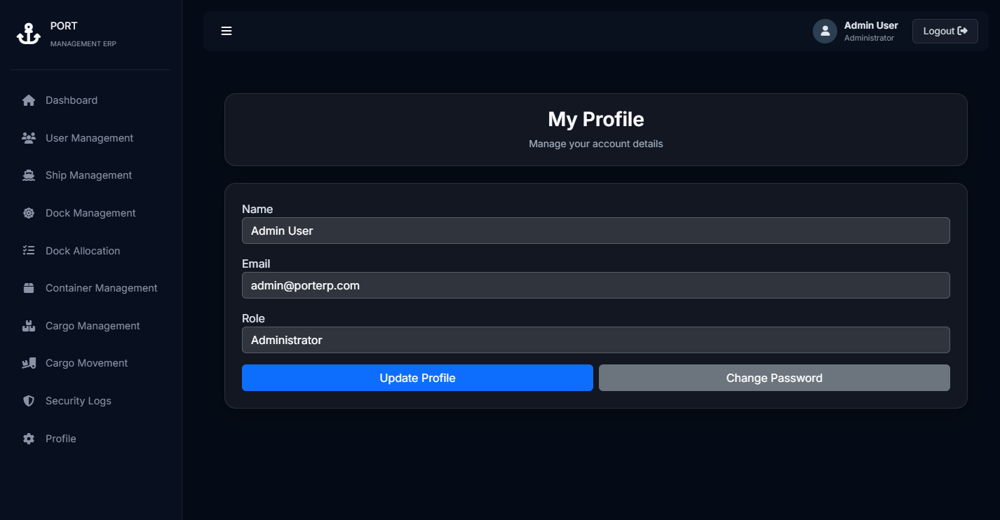</td>
  </tr>
  <tr>
    <td colspan="2" align="center">
      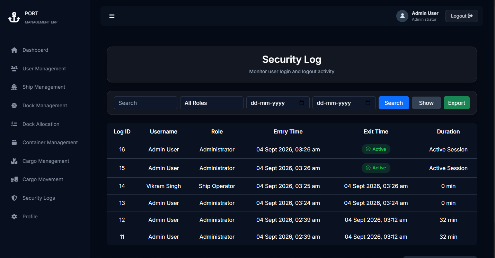
    </td>
  </tr>
</table>


## ✨ Features

- 🔐 User login and logout
- 📊 Port operations dashboard
- 🚢 Ship management
- 📦 Cargo management
- 🚛 Container management
- ⚓ Dock management
- 📍 Dock allocation management
- 🔄 Cargo movement tracking
- 👤 User management
- 👨‍💼 User profile management
- 🔒 Security activity logs
- 🗄️ MySQL database integration
- 📱 Responsive web interface

---

## 🔐 Role-Based Access Control

The system implements **role-based access control (RBAC)**. After authentication, users receive access to application modules according to their assigned role and permissions.

The system includes five roles:

| Role | Access Level |
|---|---|
| **Administrator** | Full system access, including user and role management |
| **Port Manager** | Access to port-wide operational management |
| **Ship Operator** | Access to ship and related operational management |
| **Dock Manager** | Access to dock and dock-related operations |
| **Cargo Handler** | Access to cargo and cargo movement operations |

The **Administrator** has the highest level of access and can manage users, roles, and their permissions. Other roles are restricted to the operations relevant to their responsibilities.

### Access Control Examples

- **Administrator** can manage users and roles.
- **Administrator and Port Manager** can view and search security logs.
- **Administrator, Port Manager, and Ship Operator** can manage containers.
- **Administrator, Port Manager, and Cargo Handler** can manage cargo.
- Users with lower-level roles cannot perform Administrator-only operations.
- Users cannot change their role unless they have Administrator privileges.

This access control is enforced at the database operation level to prevent unauthorized operations.

## 🛠️ Technology Stack

| Technology | Purpose |
|---|---|
| Java | Backend development |
| JSP | Dynamic web pages |
| Servlets | Request handling and controllers |
| JDBC | Database connectivity |
| MySQL | Database management |
| Bootstrap | Responsive user interface |
| HTML5 | Web page structure |
| CSS3 | Styling |
| Apache Tomcat 8.5 | Application server |
| Eclipse IDE | Development environment |
| MySQL Workbench | Database management |
| XAMPP | Local MySQL server |

---

## 🏗️ Project Architecture

The application follows a layered architecture:

```text
                    ┌─────────────────┐
                    │    JSP / UI     │
                    └────────┬────────┘
                             │
                    ┌────────▼────────┐
                    │   Controllers   │
                    │    Servlets     │
                    └────────┬────────┘
                             │
                    ┌────────▼────────┐
                    │   Operations    │
                    └────────┬────────┘
                             │
                    ┌────────▼────────┐
                    │  Implementors   │
                    └────────┬────────┘
                             │
                    ┌────────▼────────┐
                    │      JDBC       │
                    └────────┬────────┘
                             │
                    ┌────────▼────────┐
                    │      MySQL      │
                    └─────────────────┘
```

### Main Java Packages

```text
src/main/java/
├── controller/
├── db_config/
├── implementor/
├── models/
└── operations/
```

---

## 📋 Modules

| Module | Description |
|---|---|
| Dashboard | Overview of port activities and information |
| Ships | Add, view, update and manage ship records |
| Cargo | Manage cargo records |
| Containers | Manage container information |
| Docks | Manage port dock information |
| Dock Allocation | Manage dock allocation for port operations |
| Cargo Movement | Track cargo movement |
| Users | Manage application users |
| Profile | View and manage user profile information |
| Security Logs | Monitor system activity and security events |

---


## 💾 Database Setup

The application uses **MySQL**.

The complete database script is provided in:

```text
port_erp.sql`
```

### Setup

1. Start MySQL using XAMPP or your local MySQL installation.
2. Open MySQL Workbench.
3. Connect to your local MySQL server.
4. Create a new SQL Query Tab.
5. Open `port_erp.sql` from this repository.
6. Copy the complete SQL code.
7. Paste it into the new query tab.
8. Press **Ctrl + Enter** to execute the SQL.
9. The required database, tables, and sample records will be created.

### Database Connection

Open:

```text
src/main/java/db_config/GetConnection.java
```

Update the database URL, database name, username, and password according to your local MySQL configuration.

---

## 🚀 How to Run

### Requirements

- Java JDK 8 or compatible version
- Eclipse IDE with Web/Enterprise Java support
- Apache Tomcat 8.5
- MySQL
- MySQL Workbench
- XAMPP (if using XAMPP for MySQL)
- Git

### 1. Clone the Repository

```bash
git clone https://github.com/java-py7/Port-Management-ERP.git
cd Port-Management-ERP
```

### 2. Open in Eclipse

1. Open Eclipse.
2. Select **File → Import**.
3. Select **General → Existing Projects into Workspace**.
4. Select the cloned `Port-Management-ERP` folder.
5. Click **Finish**.

### 3. Configure Tomcat

1. Add Apache Tomcat 8.5 to Eclipse.
2. Add the project to the Tomcat server.
3. Clean/publish the project if required.
4. Start the Tomcat server.

### 4. Configure MySQL

Follow the **Database Setup** section above and make sure the connection details in `GetConnection.java` match your local MySQL configuration.

### 5. Run

Open:

```text
http://localhost:8080/Port_erp/login
```

The context path may differ if the deployment name is changed in Eclipse/Tomcat.

---

## 🔑 Login

Use the sample user credentials available in the database created from `port_erp.sql`.

Additional users can be created through the User Management module or directly in the database according to the application's user table structure.

---

## 🔒 Security

This project is intended for educational and development purposes.

Do not commit real database passwords, API keys, authentication tokens, or other sensitive credentials to the repository.

---


## 👨‍💻 Author

**Java-Py7**

---

## 📄 License

This project currently does not include an open-source license.
